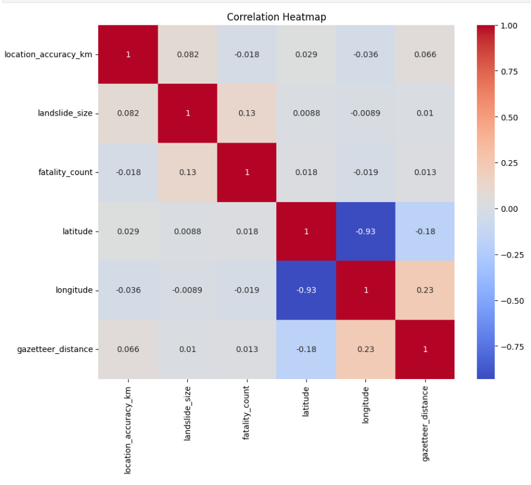
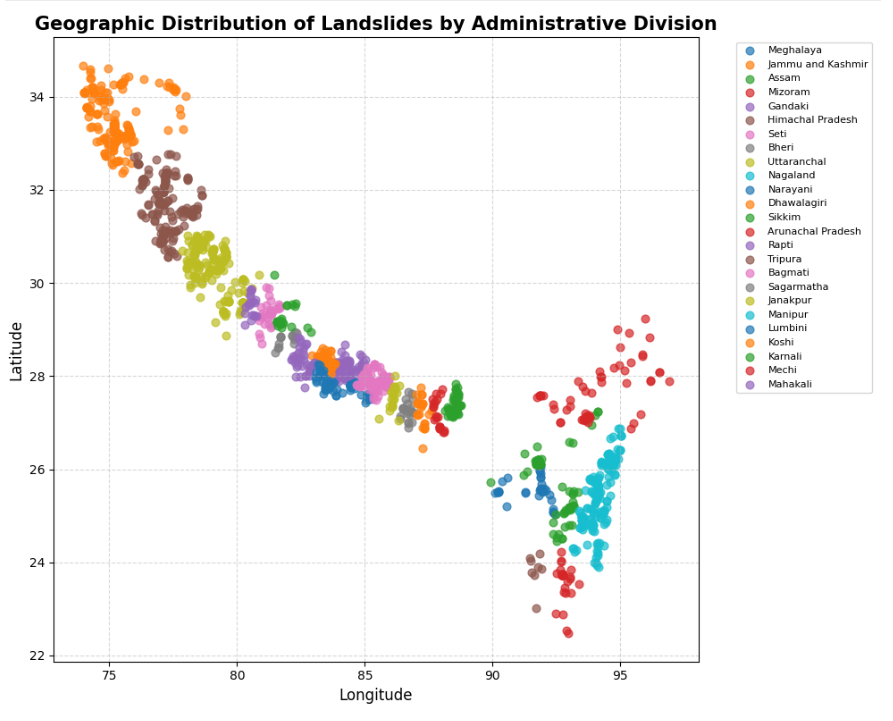
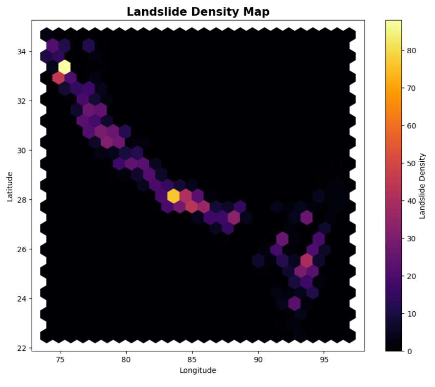
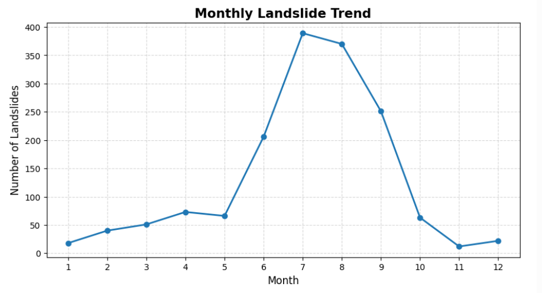
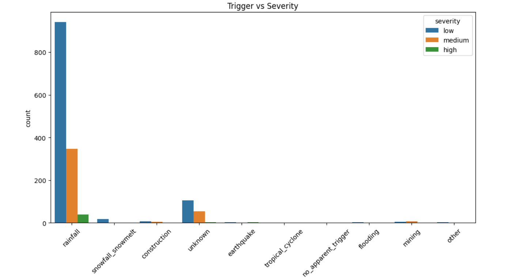
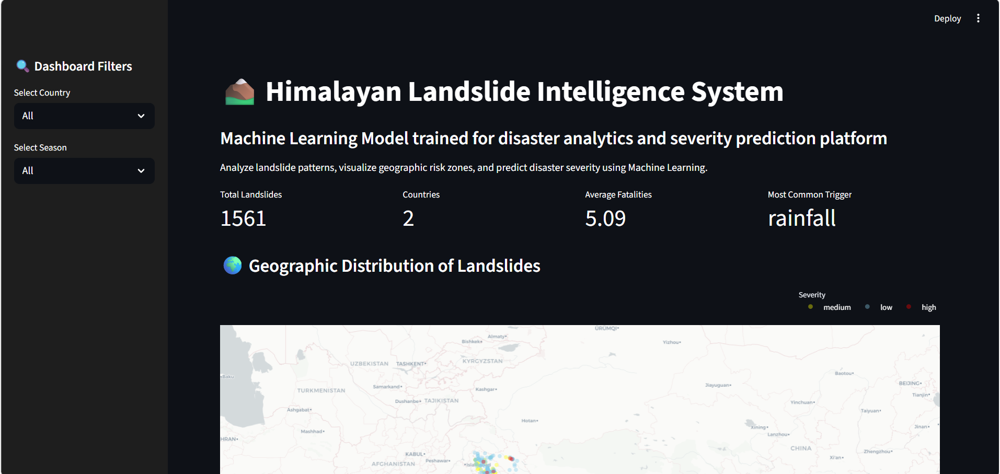
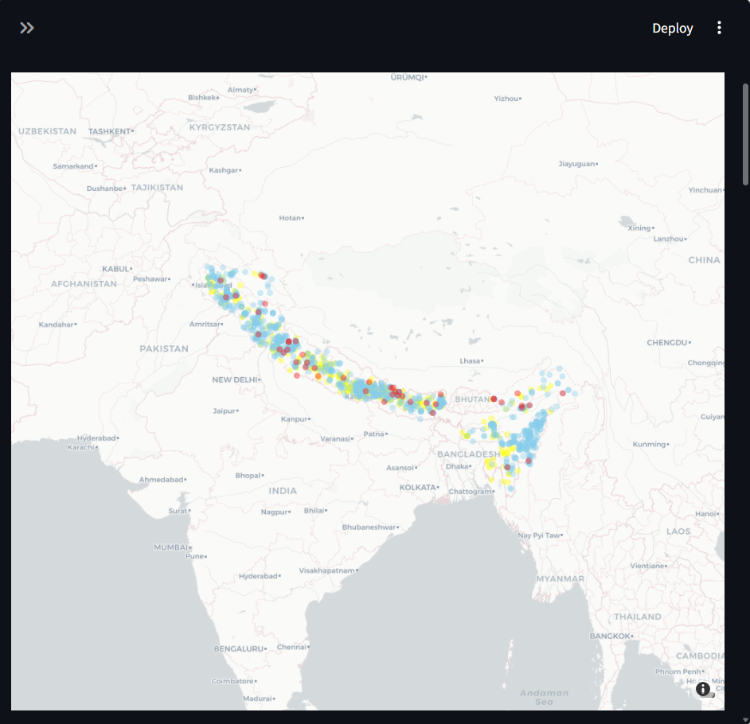
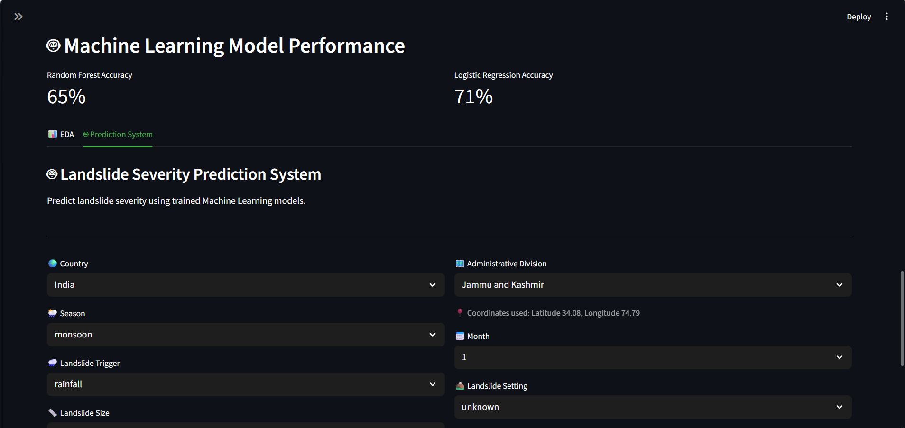

# 🌄 Himalayan Landslide Intelligence

### End-to-End Data Analytics & Machine Learning Solution for Landslide Severity Prediction in the Himalayan Region of India and Nepal

---

## 📌 Project Overview

Himalayan Landslide Intelligence is an end-to-end data analytics and machine learning project designed to analyze historical landslide events and predict landslide severity using environmental, geographical, and event-related attributes.

The project leverages NASA's Cooperative Open Online Landslide Repository (COOLR) dataset and combines data preprocessing, exploratory data analysis, machine learning, and interactive dashboarding to generate actionable insights for disaster management and risk assessment.

---

## 📑 Table of Contents

- [Project Overview](#-project-overview)
- [Problem Statement](#-problem-statement)
- [Dataset Description](#-dataset-description)
- [Technology Stack](#️-technology-stack)
- [Project Workflow](#-project-workflow)
- [Exploratory Data Analysis](#-exploratory-data-analysis)
- [Machine Learning Models](#-machine-learning-models)
- [Dashboard](#-interactive-dashboard)
- [Key Findings](#-key-findings)
- [Repository Structure](#-repository-structure)
- [Installation & Usage](#-installation--usage)
- [Future Improvements](#-future-improvements)

---

## 🎯 Problem Statement

Landslides pose a major threat to life, infrastructure, and transportation networks across mountainous regions. Predicting landslide severity and understanding key triggering factors can help improve disaster preparedness and risk mitigation strategies.

This project aims to analyze historical landslide events and develop machine learning models capable of classifying landslide severity into meaningful risk categories.

---

## 📊 Dataset Description

**Source:** NASA COOLR (Cooperative Open Online Landslide Repository)

### Features Used

- Event Date
- Location
- Country
- Trigger Type
- Fatality Count
- Latitude & Longitude
- Landslide Category
- Additional Event Attributes

### Target Variable

- 🟢 Low Severity
- 🟠 Medium Severity
- 🔴 High Severity

---

## 🛠️ Technology Stack

### Programming

- Python

### Data Analysis

- Pandas
- NumPy

### Visualization

- Matplotlib
- Seaborn
- Plotly

### Machine Learning

- Scikit-Learn
- Logistic Regression
- Random Forest

### Dashboard

- Streamlit

---

## 🔄 Project Workflow

```text
NASA Landslide Dataset
        ↓
Data Collection
        ↓
Data Cleaning
        ↓
Exploratory Data Analysis
        ↓
Feature Engineering
        ↓
Model Training
        ↓
Severity Prediction
        ↓
Interactive Dashboard
```

## 📈 Exploratory Data Analysis

### Correlation Heatmap



### Geographic Distribution



### Landslide Density Map



### Monthly Trends



### Trigger vs Severity



---

## 🤖 Machine Learning Models

Models implemented:

- Logistic Regression
- Random Forest Classifier

Evaluation Metrics:

- Accuracy
- Precision
- Recall
- F1 Score

Random Forest achieved the strongest predictive performance for severity classification.

---

## 📊 Interactive Dashboard

### Dashboard Home



### Map Dashboard



### Prediction Dashboard



### Insights Dashboard


---

## 🔑 Key Findings

### 1. Seasonal Impact

Monsoon months exhibit significantly higher landslide activity.

### 2. Geographic Hotspots

Several Himalayan regions consistently report higher incident frequencies.

### 3. Trigger Influence

Rainfall-related triggers contribute heavily to severe landslide events.

### 4. Predictive Modeling

Machine learning models can effectively classify landslide severity using historical event data.

---

## 📂 Repository Structure

```text
Himalayan-Landslide-Intelligence/
│
├── dashboard/
├── data/
├── notebooks/
├── src/
├── README.md
├── requirements.txt
└── .gitignore
```

---

## 🚀 Installation & Usage

### Clone Repository

```bash
git clone https://github.com/yourusername/Himalayan-Landslide-Intelligence.git
```

### Install Dependencies

```bash
pip install -r requirements.txt
```

### Run Dashboard

```bash
streamlit run dashboard/app.py
```

---

## 🚀 Future Improvements

- Real-time weather integration
- Satellite imagery analysis
- GIS-based risk prediction
- Deep Learning models
- Early Warning Systems

---

## 👤 Author

**Nandini More**

Python • SQL • Power BI • Machine Learning • Data Analytics

⭐ If you found this project useful, consider giving it a star.
